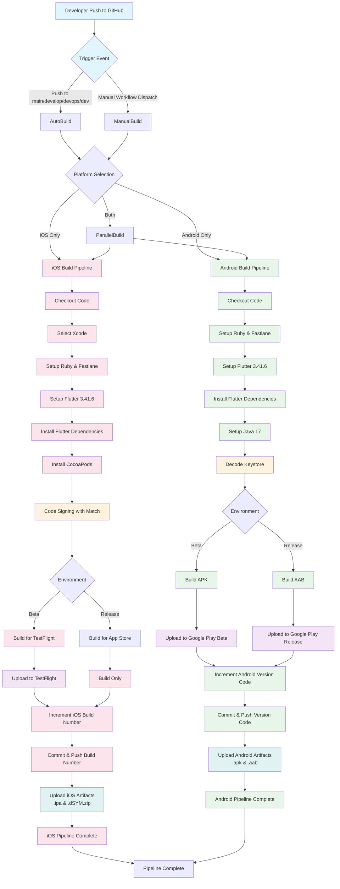
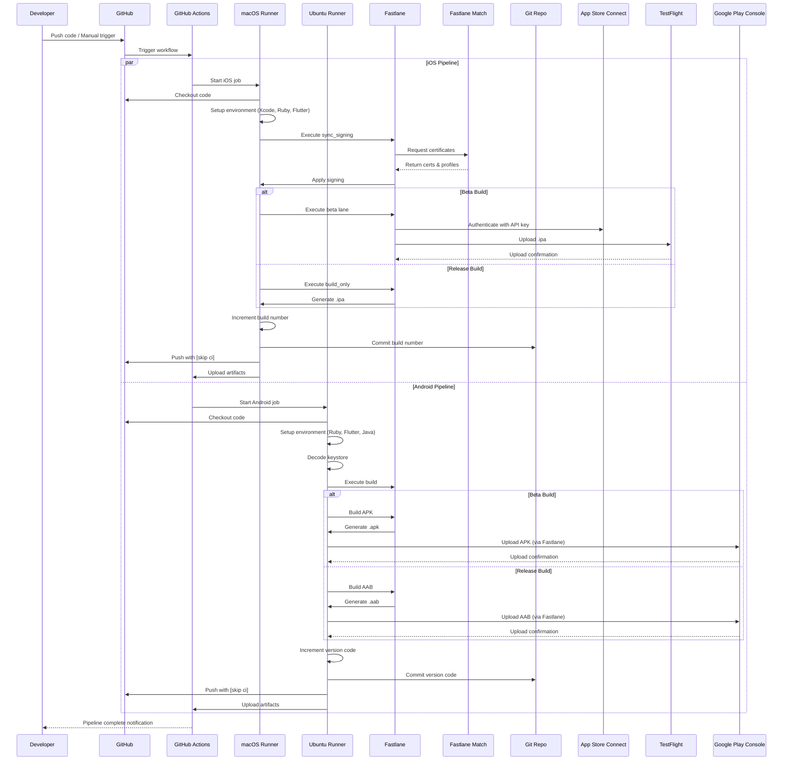

# Mobile App Build Pipeline Flow Diagram

## Overview

This document illustrates the complete CI/CD pipeline flow from GitHub to both App Store (iOS) and Google Play Store (Android).

## Pipeline Flow Diagram

## Detailed Process Flow

### Step 1: Build Pipeline with Code Signing

#### iOS Build Process
1. **Code Checkout**: Fetch latest code from GitHub
2. **Environment Setup**:
   - Select Xcode
   - Setup Ruby 3.2 + Fastlane
   - Setup Flutter 3.41.6
   - Install Flutter dependencies (`flutter pub get`)
   - Install CocoaPods dependencies
3. **Code Signing**:
   - Use Fastlane Match for certificate management
   - Sync signing certificates and provisioning profiles
   - Required secrets: `MATCH_PASSWORD`, `FASTLANE_PASSWORD`, Apple API keys
4. **Build**:
   - Beta: Build and upload to TestFlight
   - Release: Build for App Store distribution

#### Android Build Process
1. **Code Checkout**: Fetch latest code from GitHub
2. **Environment Setup**:
   - Setup Ruby 3.2 + Fastlane
   - Setup Flutter 3.41.6
   - Install Flutter dependencies
   - Setup Java 17
3. **Code Signing**:
   - Decode base64-encoded keystore
   - Required secrets: `ANDROID_KEYSTORE_BASE64`, `ANDROID_KEYSTORE_PASSWORD`, key alias
4. **Build**:
   - Beta: Build APK for testing
   - Release: Build AAB for Play Store

### Step 2: Artifact Upload to Testing Platforms

#### iOS - TestFlight (Beta)
- Automatically uploaded via Fastlane `beta` lane
- Available for internal and external testers
- Build artifacts stored for 30 days

#### Android - Google Play Store (Beta)
- APK built for beta testing
- Uploaded via Fastlane
- Available through Play Store internal/alpha/beta tracks
- Build artifacts stored for 30 days

### Step 3: Version Synchronization

#### iOS Version Management
- Build number auto-incremented in `ios/Runner.xcodeproj/project.pbxproj`
- Git commit with `[skip ci]` to prevent pipeline loops
- Ensures unique build for every commit

#### Android Version Management
- Version code auto-incremented in `android/app/build.gradle`
- Git commit with `[skip ci]` to prevent pipeline loops
- Ensures unique build for every commit

## Triggers

### Automatic Triggers
- Push to `main` branch
- Push to `develop` branch
- Push to `devops/dev` branch
- Changes in: `lib/**`, `android/**`, `ios/**`, `pubspec.yaml`

### Manual Triggers
- GitHub Actions workflow dispatch
- Parameters:
  - Platform: `ios`, `android`, or `both`
  - Environment: `beta` or `release`

## Environments

### iOS Environments
- **APP_STORE_CONFIG**: Used for both beta and release builds
- Required variables: Apple Team ID, Fastlane user, Match Git URL, API keys

### Android Environments
- **ANDROID_BETA_CONFIG**: For beta/APK builds
- **ANDROID_RELEASE_CONFIG**: For release/AAB builds
- Required secrets: Keystore file, passwords, key alias

## Artifacts

### iOS Artifacts
- `.ipa` file (30-day retention)
- `.dSYM.zip` for crash reporting (30-day retention)

### Android Artifacts
- `.aab` file for Play Store (30-day retention)
- `.apk` file for testing (30-day retention)

## Security

### Secrets Management
- All sensitive data stored in GitHub Secrets
- Certificates managed via Fastlane Match
- Keystore stored as base64-encoded secret
- API keys for App Store Connect and Google Play

### Code Signing
- iOS: Match-based certificate management
- Android: Keystore-based signing
- Automatic sync on each build

## Component Interaction Diagram

## Interaction Details

### iOS Interactions
1. **GitHub → macOS Runner**: Job initiation and code checkout
2. **Fastlane ↔ Match**: Certificate and provisioning profile retrieval
3. **Fastlane → App Store Connect**: Authentication and API communication
4. **Fastlane → TestFlight**: IPA upload for beta testing
5. **macOS Runner → Git**: Build number increment commits
6. **macOS Runner → GitHub Actions**: Artifact upload

### Android Interactions
1. **GitHub → Ubuntu Runner**: Job initiation and code checkout
2. **Ubuntu Runner → Keystore**: Local decoding and signing
3. **Fastlane → Google Play Console**: APK/AAB upload via API
4. **Ubuntu Runner → Git**: Version code increment commits
5. **Ubuntu Runner → GitHub Actions**: Artifact upload

### Key Interaction Points
- **Secrets Flow**: GitHub Secrets → Runner environment variables → Fastlane
- **Code Signing**: Match (iOS) / Keystore (Android) → Build process
- **Version Control**: Auto-increment → Git commit → GitHub push with `[skip ci]`
- **Artifact Storage**: Build outputs → GitHub Actions artifacts (30-day retention)
- **Platform Communication**: Fastlane acts as intermediary for Apple/Google APIs
